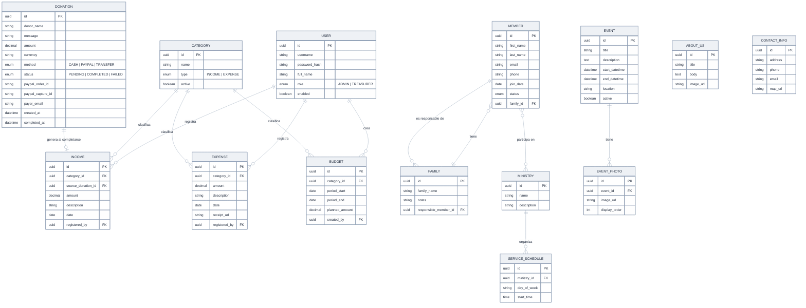

# ICAR API — ERD

Modelo de datos inicial por módulo. Ver [Notas](./Notas.md) para decisiones de diseño y contexto. Este es un punto
de partida — ajusta campos/relaciones a medida que lo implementes, no es definitivo.

