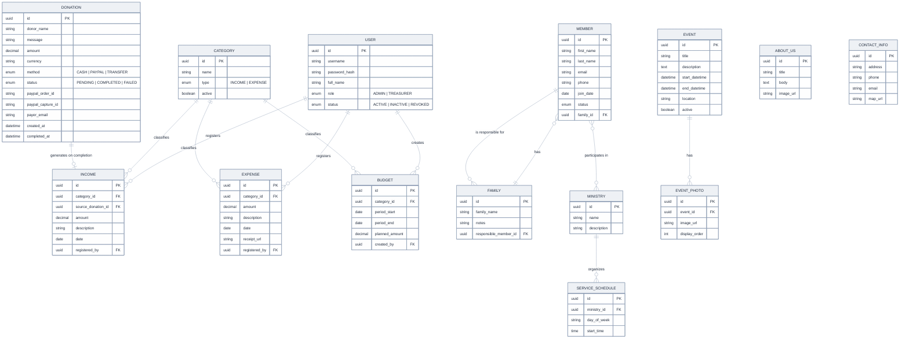

# ICAR API — ERD

Initial data model by module. See [Notes](./Notes.md) for design decisions and context. This is a starting
point — adjust fields/relationships as you implement, it's not final.

```mermaid
%%{init: {'theme': 'base', 'themeVariables': {'primaryColor': '#eef1f5', 'primaryBorderColor': '#94a3b8', 'primaryTextColor': '#1e293b', 'lineColor': '#94a3b8', 'attributeBackgroundColorOdd': '#ffffff', 'attributeBackgroundColorEven': '#eef1f5', 'fontSize': '14px'}}}%%
erDiagram
    %% --- Financial cluster (all interconnected) ---
    USER {
        uuid id PK
        string username
        string password_hash
        string full_name
        enum role "ADMIN | TREASURER"
        enum status "ACTIVE | INACTIVE | REVOKED"
    }

    DONATION {
        uuid id PK
        string donor_name
        string message
        decimal amount
        string currency
        enum method "CASH | PAYPAL | TRANSFER"
        enum status "PENDING | COMPLETED | FAILED"
        string paypal_order_id
        string paypal_capture_id
        string payer_email
        datetime created_at
        datetime completed_at
    }

    CATEGORY {
        uuid id PK
        string name
        enum type "INCOME | EXPENSE"
        boolean active
    }

    INCOME {
        uuid id PK
        uuid category_id FK
        uuid source_donation_id FK
        decimal amount
        string description
        date date
        uuid registered_by FK
    }

    EXPENSE {
        uuid id PK
        uuid category_id FK
        decimal amount
        string description
        date date
        string receipt_url
        uuid registered_by FK
    }

    BUDGET {
        uuid id PK
        uuid category_id FK
        date period_start
        date period_end
        decimal planned_amount
        uuid created_by FK
    }

    %% --- Membership cluster (interconnected) ---
    MEMBER {
        uuid id PK
        string first_name
        string last_name
        string email
        string phone
        date join_date
        enum status
        uuid family_id FK
    }

    FAMILY {
        uuid id PK
        string family_name
        string notes
        uuid responsible_member_id FK
    }

    MINISTRY {
        uuid id PK
        string name
        string description
    }

    SERVICE_SCHEDULE {
        uuid id PK
        uuid ministry_id FK
        string day_of_week
        time start_time
    }

    %% --- Events cluster (interconnected) ---
    EVENT {
        uuid id PK
        string title
        text description
        datetime start_datetime
        datetime end_datetime
        string location
        boolean active
    }

    EVENT_PHOTO {
        uuid id PK
        uuid event_id FK
        string image_url
        int display_order
    }

    %% --- No relations: public site singleton content ---
    ABOUT_US {
        uuid id PK
        string title
        text body
        string image_url
    }

    CONTACT_INFO {
        uuid id PK
        string address
        string phone
        string email
        string map_url
    }

    DONATION ||--o| INCOME : "generates on completion"
    CATEGORY ||--o{ INCOME : "classifies"
    CATEGORY ||--o{ EXPENSE : "classifies"
    CATEGORY ||--o{ BUDGET : "classifies"
    USER ||--o{ INCOME : "registers"
    USER ||--o{ EXPENSE : "registers"
    USER ||--o{ BUDGET : "creates"
    FAMILY ||--o{ MEMBER : "has"
    MEMBER ||--o{ FAMILY : "is responsible for"
    MEMBER }o--o{ MINISTRY : "participates in"
    MINISTRY ||--o{ SERVICE_SCHEDULE : "organizes"
    EVENT ||--o{ EVENT_PHOTO : "has"
```
